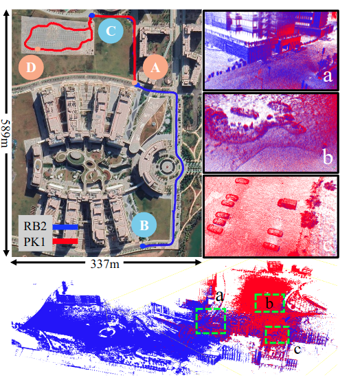
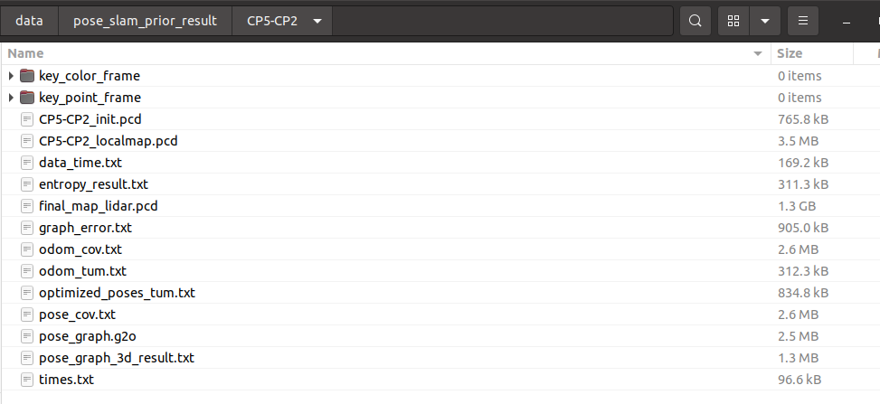
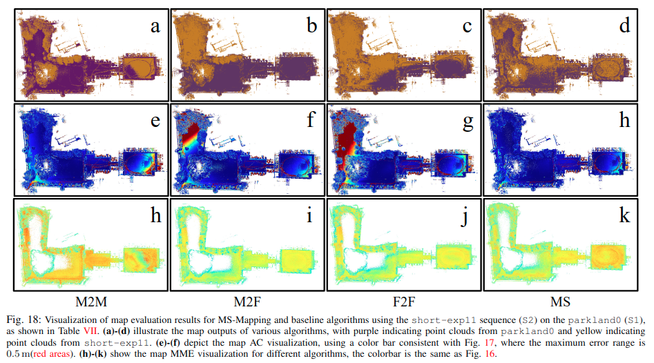
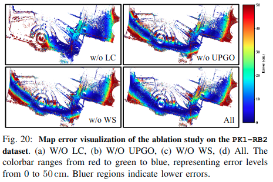

<div id="top" align="center">

# [MS-Mapping: An Uncertainty-Aware Large-Scale Multi-Session LiDAR Mapping System](https://arxiv.org/abs/2408.03723)

<div align="center">

.png)


</div>

[](https://opensource.org/licenses/MIT) [](https://github.com/JokerJohn/MS-Mapping/stargazers) [](https://github.com/JokerJohn/MS-Mapping/issues)

## Table of Contents

 [Introduction](#introduction)

 [News](#news)

 [Run](#Run)

 [Example](#Example)

 [Dataset](#dataset)

 [Results](#results)

 [Citations](#citations)

 [License](#license)

## Introduction

**Author**: Xiangcheng Hu, [Jin Wu](https://github.com/zarathustr), [Jianhao Jiao](https://github.com/gogojjh), [Binqian Jiang](https://github.com/lewisjiang), Wei Zhang, [Wenshuo Wang](https://github.com/wenshuowang) and Ping Tan

Large-scale multi-session LiDAR mapping is essential for a wide range of applications, including surveying, autonomous driving, crowdsourced mapping, and multi-agent navigation. However, existing approaches often struggle with data redundancy, robustness, and accuracy in complex environments. To address these challenges, we present **MS-Mapping**, an novel multi-session LiDAR mapping system that employs an incremental mapping scheme for robust and accurate map assembly in large-scale environments. Our approach introduces three key innovations:
1. **A distribution-aware keyframe selection method** that captures the subtle contributions of each point cloud frame to the map by analyzing the similarity of map distributions. This method effectively reduces data redundancy and pose graph size, while enhancing graph optimization speed;

2. **An uncertainty model** that automatically performs least-squares adjustments according to the covariance matrix during graph optimization, improving mapping precision, robustness, and flexibility without the need for scene-specific parameter tuning. This uncertainty model enables our system to monitor pose uncertainty and avoid ill-posed optimizations, thereby increasing adaptability to diverse and challenging environments.
   
3. To ensure fair evaluation, we redesign **baseline comparisons and the evaluation benchmark**. Direct assessment of map accuracy demonstrates the superiority of the proposed MS-Mapping algorithm compared to state-of-the-art methods.


<div align="center">

|  |  |
| ------------------------------------------------------------ | ------------------------------------------------------------ |

</div>


## News

- **2024/08/08**: We released the first version of MS-Mapping on [arXiv](https://arxiv.org/pdf/2408.03723), together with the example [merged data](http://gofile.me/4jm56/oO3TvgSvl)  and related [YouTube](https://www.youtube.com/watch?v=1z8EOhCmegM) and [bilibili]() videos. 
- **2024/07/19**: accepted by [ICRA@40](https://icra40.ieee.org/) as a [extended abstract](https://arxiv.org/pdf/2406.02096).
- **2024/06/03**: submit to a [workshop](https://arxiv.org/html/2406.02096v1).

## Run

Lets take `CP5` as the old session, and use `CP2` to do incremental mapping base on it.

- Build the base map using single-session uncertainty  SLAM. It's important to know the cov of each edge in pose graph. Keyframes number must be the same with the poses number.


- Set the base map as prior map folder, and preparing for the parameters of Ms-Mapping (initial pose). You can use Cloudcompare to align the first point cloud (at the map folder) with the base map to get the initial pose.  (This problem can be solved when you integrate a place recognition algorithm into our system).

  

  


- Run the Ms-Mapping and save the merged data. The keyframe folder  only save the keyframes of the new session data.




- Use the [python scripts](https://github.com/JokerJohn/SLAMTools/tree/main/Ms_mapping) to get and visualize all the session trajectory and session map, together with the merged map.


- set the new base map `CP5-CP2` for the next mapping round. You need to add the keyframes of `CP5` into this folder. There must be a `map.pcd ` file in the map folder. Check the keyframes number with the pose files.

  

## Example

We provide example merged data for 8 sessions [here](http://gofile.me/4jm56/xNhE1scBX), The session order is: ` CP5-CP2-CS1-CC1-PK1-IA3-IA4-NG`. **One must clean the separate map to remove the point cloud noise caused by the glass**, since this study do not focus on this.  The cleaned map also can be [download here](http://gofile.me/4jm56/jyhJf373SJ). Note that these example data may be updated since it is not the best results.


[Plot the results](https://github.com/JokerJohn/SLAMTools/tree/main/Ms_mapping):

```python
#trjectory
python3 tum-trajectory-plotter.py 

#map
pcl_viewer merged_map_session_*
```


## Dataset

#### [Fusion Portable V2 Dataset](https://fusionportable.github.io/dataset/fusionportable_v2/)

#### [Newer College](https://ori-drs.github.io/newer-college-dataset/)

#### [Urban-Nav](https://github.com/IPNL-POLYU/UrbanNavDataset)

#### [MS-Dataset](https://github.com/JokerJohn/MS-Dataset)


### Trajectory Evaluation


|  |  |
| ------------------------------------------------------------ | ------------------------------------------------------------ |


### Map Evaluation

|  |  |
| ------------------------------------------------------------ | ------------------------------------------------------------ |


<div align="center">




</div>


<div align="center">



</div>

### Time Analysis

<div align="center">


</div>

To plot the results, you can follow this [scripts](https://github.com/JokerJohn/SLAMTools/blob/main/Run_Time_analysis/time_analysis.py).


## Citations

Please cite:
```latex
@misc{hu2024msmapping,
      title={MS-Mapping: Multi-session LiDAR Mapping with Wasserstein-based Keyframe Selection}, 
      author={Xiangcheng Hu, Jin Wu, Jianhao Jiao, Wei Zhang and Ping Tan},
      year={2024},
      eprint={2406.02096},
      archivePrefix={arXiv},
      primaryClass={cs.RO}
}
```

```latex
@misc{hu2024msmappinguncertaintyawarelargescalemultisession,
      title={MS-Mapping: An Uncertainty-Aware Large-Scale Multi-Session LiDAR Mapping System}, 
      author={Xiangcheng Hu, Jin Wu, Jianhao Jiao, Binqian Jiang, Wei Zhang, Wenshuo Wang and Ping Tan},
      year={2024},
      eprint={2408.03723},
      archivePrefix={arXiv},
      primaryClass={cs.RO},
      url={https://arxiv.org/abs/2408.03723}, 
}
```

## License

This project's code is available under the [MIT LICENSE](./LICENSE).
