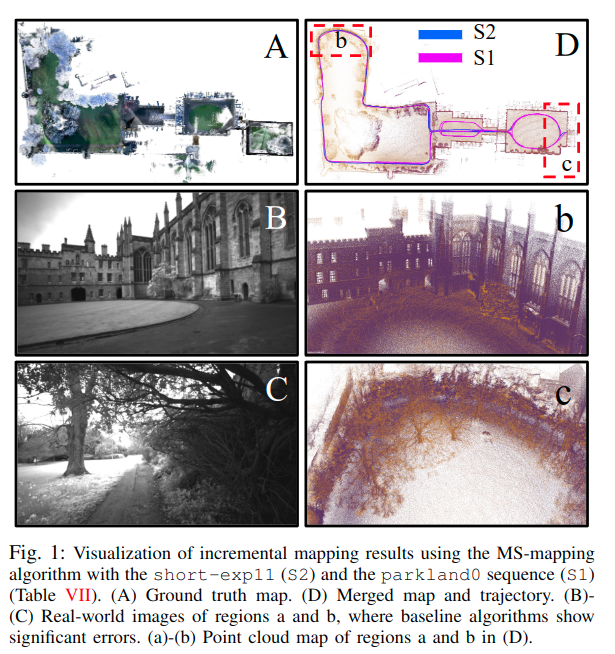
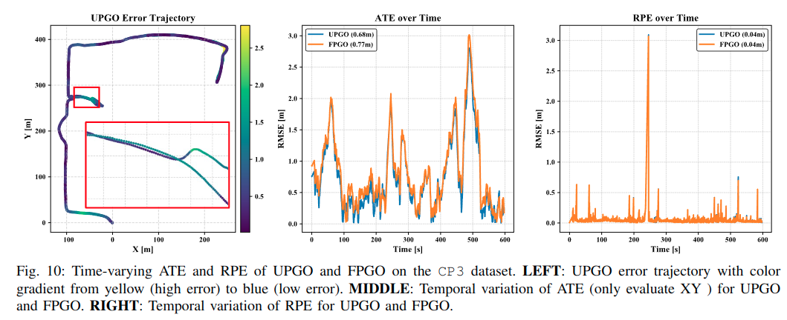
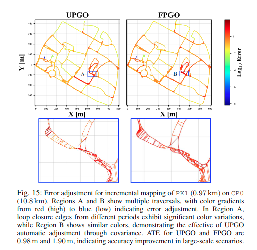
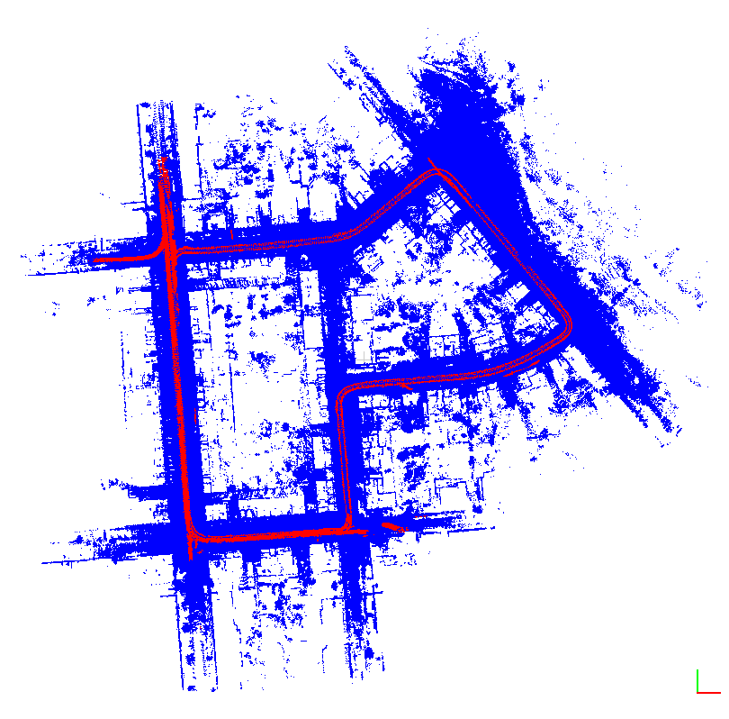

<div align="center">

<h1>MS-Mapping: An Uncertainty-Aware Large-Scale Multi-Session LiDAR Mapping System</h1>

[**Xiangcheng Hu**](https://github.com/JokerJohn)<sup>1</sup> · [**Jin Wu**](https://zarathustr.github.io/)<sup>1</sup> · [**Jianhao Jiao**](https://gogojjh.github.io/)<sup>2*</sup>
<br>
[**Binqian Jiang**](https://github.com/lewisjiang) <sup>1</sup>· [**Wei Zhang**](https://ece.hkust.edu.hk/eeweiz)<sup>1</sup> · [**Wenshuo Wang**](https://wenshuowang.github.io/)<sup>3</sup> · [**Ping Tan**](https://facultyprofiles.hkust.edu.hk/profiles.php?profile=ping-tan-pingtan#publications)<sup>1*&dagger;</sup>

<sup>1</sup>HKUST&emsp;&emsp;&emsp;<sup>2</sup>UCL&emsp;&emsp;&emsp;<sup>3</sup>BIT  
<br>
&dagger;project lead&emsp;*corresponding author

<a href="https://arxiv.org/pdf/2408.03723"></a><a href="https://www.youtube.com/watch?v=1z8EOhCmegM"></a>[](https://www.bilibili.com/video/BV1RW42197mV/?spm_id_from=333.999.0.0)[](https://github.com/JokerJohn/MS-Mapping/stargazers) [](https://github.com/JokerJohn/MS-Mapping/issues)[](https://opensource.org/licenses/MIT)<a href="https://github.com/JokerJohn/MS-Mapping/blob/main/"></a>

</div>

MS-Mapping is a novel multi-session LiDAR mapping system designed for large-scale environments. It addresses challenges in data redundancy, robustness, and accuracy with three key innovations:
- **Distribution-aware keyframe selection**: Captures the contributions of each point cloud frame by analyzing map distribution similarities. This reduces data redundancy and optimizes graph size and speed.

- **Uncertainty model**: Automatically adjusts using the covariance matrix during graph optimization, enhancing precision and robustness without scene-specific tuning. It monitors pose uncertainty to avoid ill-posed optimizations.

- **Enhanced evaluation**: Redesigned baseline comparisons and benchmarks demonstrate MS-Mapping's superior accuracy over state-of-the-art methods.

Applications include surveying, autonomous driving, crowd-sourced mapping, and multi-agent navigation.

## News
- **2025/03/26**: Add new databag `RB3` and new [Tutorial](tutorial/INSTALL.md) ! Feel free to pull issues for any questions related to this work!
- **2025/02/26**: Baseline method **F2F** and **M2F** released! [Tutorial](tutorial/INSTALL.md) is here!
- **2024/08/08**: We released the first version of MS-Mapping on [ArXiv](https://arxiv.org/pdf/2408.03723), together with the example [merged data](http://gofile.me/4jm56/4EUwIMPff)  and related [YouTube](https://www.youtube.com/watch?v=1z8EOhCmegM) and [bilibili](https://www.bilibili.com/video/BV1RW42197mV/?spm_id_from=333.337.search-card.all.click) videos. 
- **2024/07/19**: accepted by [ICRA@40](https://icra40.ieee.org/) as a [extended abstract](https://arxiv.org/pdf/2406.02096).
- **2024/06/03**: submit to a [workshop](https://arxiv.org/html/2406.02096v1).

<div align="center">

.png)

|                            CP5-NG                            |                          CP5-NG-PK1                          |
| :----------------------------------------------------------: | :----------------------------------------------------------: |
|                        |        |
|  |  |


</div>

## Dataset

| [Fusion Portable V2 Dataset](https://fusionportable.github.io/dataset/fusionportable_v2/) | [Newer College](https://ori-drs.github.io/newer-college-dataset/) | [Urban-Nav](https://github.com/IPNL-POLYU/UrbanNavDataset) | [MS-Dataset](https://github.com/JokerJohn/MS-Dataset) |
| ------------------------------------------------------------ | ------------------------------------------------------------ | ---------------------------------------------------------- | ----------------------------------------------------- |


### Trajectory Evaluation



|  |  |
| ------------------------------------------------------------ | ------------------------------------------------------------ |

### Map Evaluation

<div align="center">

|  |
| ------------------------------------------------------------ |

</div>

### Time Analysis

<div align="center">


To plot the results, you can follow this [scripts](https://github.com/JokerJohn/SLAMTools/blob/main/Run_Time_analysis/time_analysis.py).
</div>

## [Quick Run](tutorial/INSTALL.md)

The implementation of baseline method **F2F** and **M2F**, only radius keyframe selection + fix-cov PGO. [Tutorial](tutorial/INSTALL.md) is here!
|  |
| ------------------------------------------------------------ |

- Step 1: using old session with single session mode (`useMultiMode = false`) to prepare data

- Step2: incrimental mapping using new session rosbag

- Step3: global map merging with giving initial pose (manually from `ClouCompare` or  place recognition methods)

- Step4: Lifelong Mapping with [BeautyMap](https://github.com/MKJia/BeautyMap) to remove dynamic points.

| Clean Map Using BeautyMap              | Ground Truth Map                                |
| -------------------------------------- | ----------------------------------------------- |
|  |  |

## TO DO

- [ ] Clean codes
- [ ] Add more dataset support
- [ ] Add place recognition algothem for initialization

## Citations

Please cite:
```bibtex
@misc{hu2024mskeyframe,
      title={MS-Mapping: Multi-session LiDAR Mapping with Wasserstein-based Keyframe Selection}, 
      author={Xiangcheng Hu, Jin Wu, Jianhao Jiao, Wei Zhang and Ping Tan},
      year={2024},
      eprint={2406.02096},
      archivePrefix={arXiv},
      primaryClass={cs.RO}
}

@misc{hu2024msmapping,
      title={MS-Mapping: An Uncertainty-Aware Large-Scale Multi-Session LiDAR Mapping System}, 
      author={Xiangcheng Hu, Jin Wu, Jianhao Jiao, Binqian Jiang, Wei Zhang, Wenshuo Wang and Ping Tan},
      year={2024},
      eprint={2408.03723},
      archivePrefix={arXiv},
      primaryClass={cs.RO},
      url={https://arxiv.org/abs/2408.03723}, 
}
```

## Acknowledgment

The code in this project is adapted from the following projects:

- The odometry  method is adapted from [FAST-LIO2](https://github.com/hku-mars/FAST_LIO).
- The basic framework for pose graph optimization (PGO) is adapted from [SC-A-LOAM](https://github.com/gisbi-kim/SC-A-LOAM).

## Contributors

<a href="https://github.com/JokerJohn/MS-Mapping/graphs/contributors">
  
</a>
